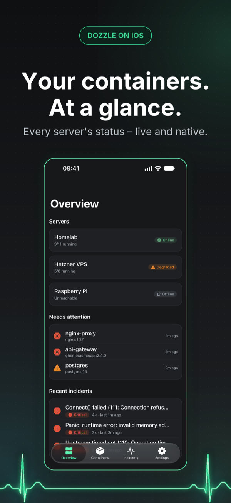
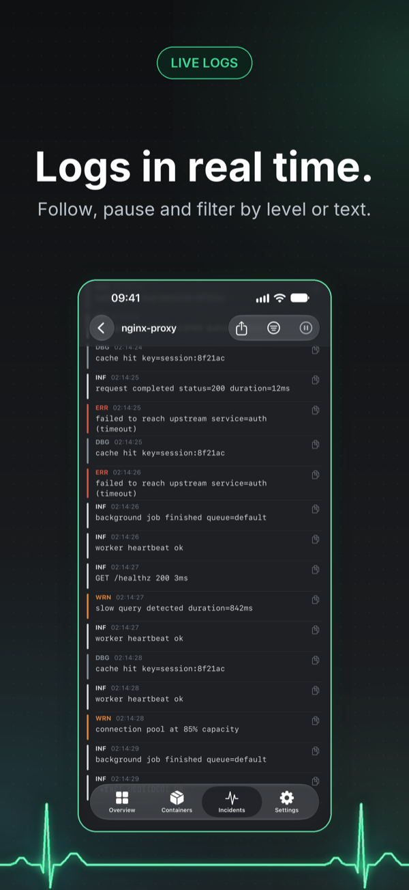
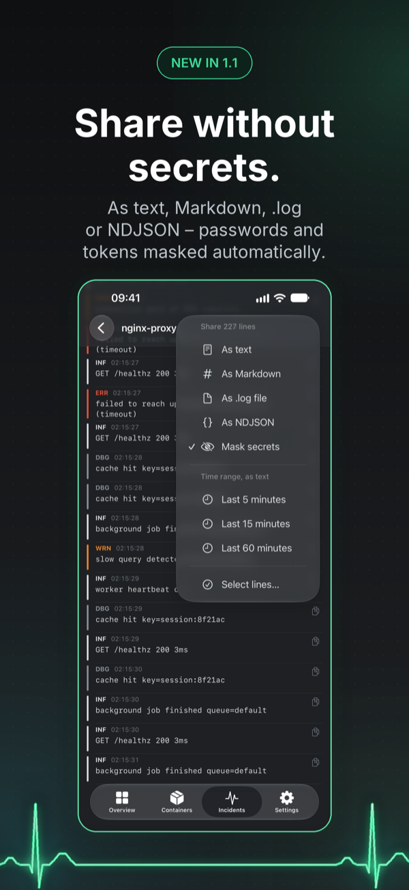
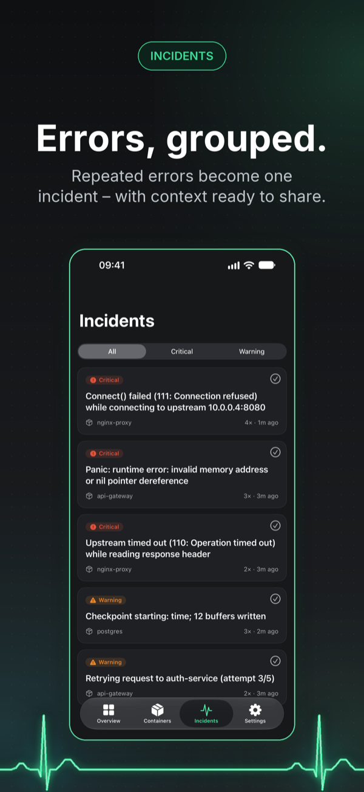
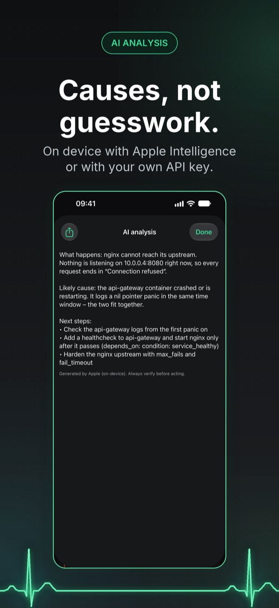
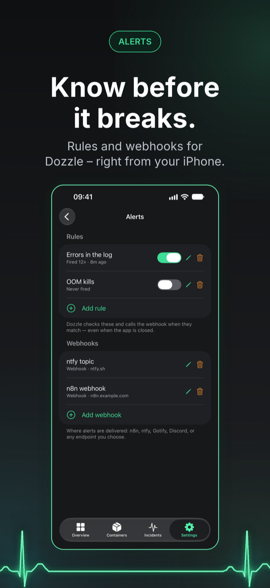

  

<h1 align="center">DockTrace</h1>

<strong>Understand container trouble. In seconds.</strong>

  A native SwiftUI client for <a href="https://github.com/amir20/dozzle">Dozzle</a> — live Docker logs, grouped incidents and alerts from your self-hosted server, on iPhone.

  <a href="https://apps.apple.com/app/id6792137606?pt=128697224&ct=github-readme&mt=8">Download on the App Store</a>
  ·
  <a href="https://www.docktrace.app/en/">Website</a>
  ·
  <a href="https://www.docktrace.app/en/changelog/">Changelog</a>
  ·
  <a href="https://github.com/apps4selfhosted/docktrace/releases">Releases</a>
  ·
  <a href="https://github.com/apps4selfhosted/docktrace/issues">Report an issue</a>

---

> DockTrace is an independent, unofficial community client. It is not part of the official
> Dozzle project — with respect and thanks to the team that builds and maintains it.

## Screenshots

<table>
  <tr>
    <td align="center"></td>
    <td align="center"></td>
    <td align="center"></td>
    <td align="center"></td>
    <td align="center"></td>
    <td align="center"></td>
  </tr>
  <tr>
    <td align="center">Overview</td>
    <td align="center">Live logs</td>
    <td align="center">Share</td>
    <td align="center">Incidents</td>
    <td align="center">AI analysis</td>
    <td align="center">Alerts</td>
  </tr>
</table>

## What it does

DockTrace brings your self-hosted Dozzle server to your iPhone: the status of every container,
live logs and grouped errors — native, fast and without detouring through the web interface.

**The big picture in seconds.** An overview of all servers, the containers that need attention and
the latest incidents. Search, filter by server, pin favourites — and keep several Dozzle servers in
one app.

**Live logs.** Logs in real time with search and level filter. The stream pauses as soon as you
scroll up and shows how many new lines have arrived. Copy single lines or select several.

**Share without secrets.** Filtered lines, a selection or the last few minutes as text, Markdown,
a .log, NDJSON or ZIP file — with container, host, server and time range in the header. Passwords,
tokens and e-mail addresses are masked automatically first.

**Incidents, not raw output.** Similar errors are grouped automatically, with severity, frequency
and last occurrence, and can be shared as a report with a log excerpt.

**AI analysis.** Explains errors and suggests next steps — on device with Apple Intelligence or
with your own key for Anthropic, OpenAI, Google or Mistral. DockTrace asks before sending anything
to a cloud provider for the first time and masks secrets.

**Alerts.** Create and manage alert rules and webhooks for Dozzle 10 and later right from your
iPhone.

**Your data stays yours.** Logs only travel between your server and your device. Credentials and
API keys live in the Keychain on this device only, and the app lock with Face ID keeps logs out of
the app switcher. No server yet? Demo mode shows DockTrace with sample data.

## Requirements

- A running [Dozzle](https://github.com/amir20/dozzle) server (alerts need Dozzle 10 or later) — or try the built-in demo mode
- iOS 18.6 or later
- Free download with a 7-day trial of every Pro feature. DockTrace Pro is a one-time purchase — no subscription.

## Support

This repository is the public place for bug reports and feature requests:

- 🐞 [Report a bug](https://github.com/apps4selfhosted/docktrace/issues/new?template=bug_report.yml)
- 💡 [Request a feature](https://github.com/apps4selfhosted/docktrace/issues/new?template=feature_request.yml)
- ❓ [Frequently asked questions](https://www.docktrace.app/en/faq/)

Prefer not to post publicly? The [support form](https://www.docktrace.app/en/support/) reaches the
same place privately. Replies usually within one to two days.

The app's source code is not hosted here — this repository exists for support, documentation and
releases.

## Related apps

Other native iOS clients for self-hosted services, by the same developer:
[Mobile MA](https://www.mobile-ma.app/) (Music Assistant) ·
[dock-g](https://www.dock-g.app/) (Dockge) ·
[gyokuro](https://www.gyokuro.app/) (Gitea/Forgejo) ·
[BookStax](https://www.bookstax.app/) (BookStack) ·
[picaroa](https://www.picaroa.app/) (PicoShare)

---

© 2026 Sven Hanold · Apps4Selfhosted

